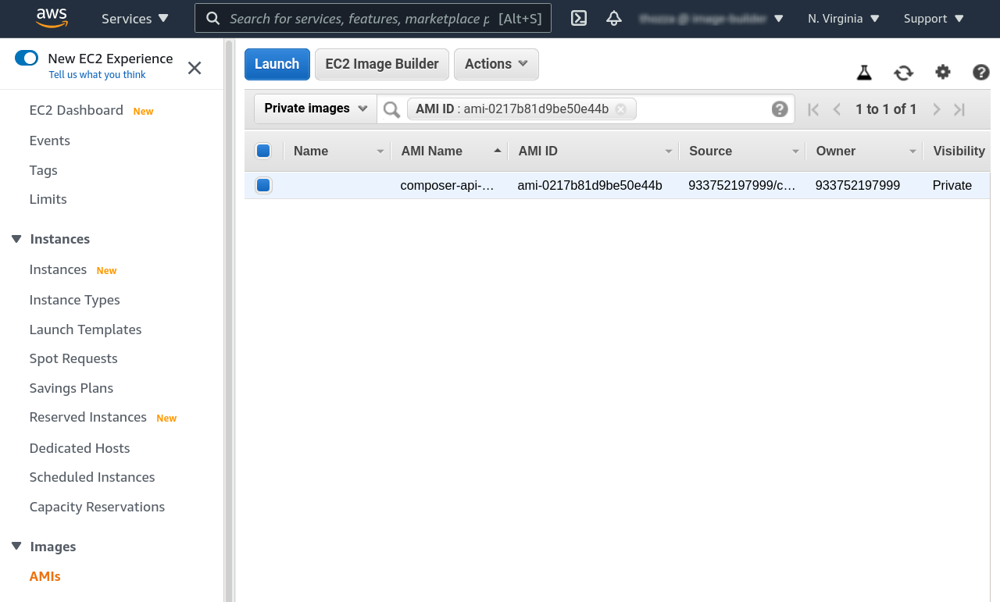

# Using Image Builder in staging environment from the command line

All you need to access the service is the “curl” tool which is available on any operating system and [a user account in staging environment](./image-builder-access.md). The staging REST API is accessible using the squid.corp.redhat.com HTTP proxy server on the Red Hat VPN.

## Testing access

Using your staging account name and password, you can display the available API endpoints like this:
```bash
curl --user "username:password" \
        --proxy http://squid.corp.redhat.com:3128 \
        https://cloud.stage.redhat.com/api/image-builder/v1/openapi.json
```

The command contains:
 * Your credentials after the `--user` CLI flag
 * URL of the HTTP proxy server after the `--proxy` flag
 * URL of the staging instance of the image builder

*Tip: If you want nice formatting of the JSON object, use the `jq` tool):*
```bash
curl --user "username:password" \
        --proxy http://squid.corp.redhat.com:3128 \
        https://cloud.stage.redhat.com/api/image-builder/v1/openapi.json | jq .
```

## Creating a new image compose

To create a new image compose, you need to submit an HTTP `POST` request to the `/v1/compose` API endpoint. The request must specify all the necessary information, which is dependent on the chosen cloud provider.

In the following example, we will create a new image compose for AWS as the cloud provider.

1. Start with creating an `image-builder-request.json` file containing a description of the image you want to create. The file content is as follows:

    ```json
    {
      "distribution": "rhel-8",
      "image_requests": [
        {
          "architecture": "x86_64",
          "image_type": "ami",
          "upload_request": {
            "type": "aws",
            "options": {
              "share_with_accounts": [
                "<your-aws-account-id>"
              ]
            }
          }
        }
      ]
    }
    ```

    Note that the value **`<your-aws-account-id>`** must be replaced with a valid AWS account ID.

    This image compose request instructs Image Builder to:
      * Create a RHEL 8 AMI image for x86\_64 architecture.
      * Upload the image to AWS EC2 and share the AMI with the specified AWS account ID.

2. Request a new image compose by making an API call using `curl`:

    ```bash
    curl --user "username:password" \
            --proxy http://squid.corp.redhat.com:3128 \
            -d "@image-builder-request.json" -X POST \
            -H "Content-Type: application/json" \
            https://cloud.stage.redhat.com/api/image-builder/v1/compose
    ```

    The command specifies:
    * JSON body of the message (`-d`)
    * HTTP `POST` method (`-X`)
    * HTTP header “Content-Type” (`-H`)

    The API endpoint will return an ID of the newly created image compose, which can be used to query its status:

    ```json
    {
      "id": "35b5fb49-3920-4a1f-a67f-8a4281c63dd7"
    }
    ```

### New AWS image compose

This section describes the structure of an AWS image compose request and valid values.

The structure of an AWS image compose request is a follows:

```json
{
  "distribution": "rhel-8",
  "image_requests": [
    {
      "architecture": "x86_64",
      "image_type": "ami",
      "upload_request": {
        "type": "aws",
        "options": {
          "share_with_accounts": [
            "<your-aws-account-id>"
          ]
        }
      }
    }
  ]
}
```

Valid `image_request` object's values for AWS are:

* `architecture` values:
  * `x86_64`
  * `aarch64`
* `image_type` values:
  * `ami`
* `upload_request.type` values:
  * `aws`
* `upload_request.options.share_with_accounts` - List of valid AWS account IDs to share the image with. You can find your AWS account ID by accessing the option [My account][aws_account] in AWS.

[aws_account]: https://console.aws.amazon.com/billing/home?#/account

### New Azure image compose

This section describes the structure of an Azure image compose request and valid values.

The structure of an Azure image compose request is a follows:

```json
{
  "distribution": "rhel-8",
  "image_requests": [
    {
      "architecture": "x86_64",
      "image_type": "vhd",
      "upload_request": {
        "type": "azure",
        "options": {
          "tenant_id": "<your-tenant-id>",
          "subscription_id": "<your-subscription-id>",
          "resource_group": "<your-resource-group>"
        }
      }
    }
  ]
}
```

Valid `image_request` object's values for Azure are:

* `architecture` values:
  * `x86_64`
* `image_type` values:
  * `vhd`
* `upload_request.type` values:
  * `azure`
* `upload_request.options.tenant_id` - ID of the tenant where the image should be uploaded. Explanation of how to find it is [available in the Azure Portal][finding_tenat_id].
* `upload_request.options.subscription_id` - ID of subscription where the image should be uploaded.
* `upload_request.options.resource_group` - Name of the resource group where the image should be uploaded.

[finding_tenat_id]: https://docs.microsoft.com/en-us/azure/active-directory/fundamentals/active-directory-how-to-find-tenant

### New GCP image compose

This section describes the structure of a GCP image compose request and valid values.

The structure of a GCP image compose request is a follows:

```json
{
  "distribution": "rhel-8",
  "image_requests": [
    {
      "architecture": "x86_64",
      "image_type": "vhd",
      "upload_request": {
        "type": "gcp",
        "options": {
          "share_with_accounts": [
            "<your-google-account>"
          ]
        }
      }
    }
  ]
}
```

Valid `image_request` object's values for GCP are:

* `architecture` values:
  * `x86_64`
* `image_type` values:
  * `vhd` (a GCP-specific image type is currently in development)
* `upload_request.type` values:
  * `gcp`
* `upload_request.options.share_with_accounts` - List of valid Google accounts to share the image with. Valid values are:
  * `user:{emailid}` - An email address that represents a specific Google account For example, `user:alice@example.com`.
  * `serviceAccount:{emailid}` - An email address that represents a service account. For example, `serviceAccount:my-other-app@appspot.gserviceaccount.com`.
  * `group:{emailid}` - An email address that represents a Google group. For example, `group:admins@example.com`.
  * `domain:{domain}` - The G Suite domain (primary) that represents all the users of that domain. For example, `domain:google.com` or `domain:example.com`.

## Monitoring status of the image compose

To query the status of previously created image compose, you need to submit an HTTP `GET` request to the `/v1/composes/<compose-id>` API endpoint. The `<compose-id>` is the ID returned by the API when the image compose was created.

In the following example, we will query the AWS image compose created in the [previous section](#creating-a-new-image-compose).

To request the image compose status, make the following API call using `curl`:

```bash
curl --user "username:password" \
        --proxy http://squid.corp.redhat.com:3128 \
        -H "Content-Type: application/json" \
        https://cloud.stage.redhat.com/api/image-builder/v1/composes/35b5fb49-3920-4a1f-a67f-8a4281c63dd7
```

The API endpoint will return an object containing the image compose status. The content will vary based on the actual state of the image compose. The following example shows a response while the image compose is still in progress:

```json
{
  "image_status": {
    "status": "running"
  }
}
```

Once the image compose is finished successfully, the response will contain additional details in the `upload_status` key. Specifically, the `type` of the cloud provider, where the image has been uploaded, the upload `status` as well as additional information to help you identify the image in the cloud provider environment under the `options` key. In this example for AWS, the AMI ID and region of the uploaded image are returned. In the case of AWS, you can go to your AWS account and check the list of available AMIs in the respective region. An example follows:

```json
{
  "image_status": {
    "status": "success",
    "upload_status": {
      "options": {
        "ami": "ami-0217b81d9be50e44b",
        "region": "us-east-1"
      },
      "status": "success",
      "type": "aws"
    }
  }
}
```

The status of a failed image compose is shown below:

```json
{
  "image_status": {
    "status": "failure"
  }
}
```

## Using the built image

Once the image build has been successfully finished, the returned `image_status.upload_status.options` structure contains important information needed to identify the image in the cloud provider environment.

The information contained in the response differs for each supported target cloud provider, but it is always consistent for the same cloud provider. Also, the user experience of using the built image differs with each cloud provider. The following sections explain how to use the image for each supported cloud provider.

Since the Image Builder does not require any credentials from the user, only information about an account, that the resulting image should be shared with, the image is not owned by the account, only shared with it. Built images will be available for 14 days and garbage collected after this period. The user is therefore advised to copy the image to their account/project to make sure they can keep using it. This applies only to AWS and GCP. Azure images are created in the user's resource group and won't be garbage collected by the Image Builder.

### Using the built AWS image

An API response for a successful image build for AWS looks as follows:

```json
{
  "image_status": {
    "status": "success",
    "upload_status": {
      "options": {
        "ami": "ami-0217b81d9be50e44b",
        "region": "us-east-1"
      },
      "status": "success",
      "type": "aws"
    }
  }
}
```

The most important parts of the response are `ami` and `region`. These will help you to locate the image and use it in the AWS environment.

To locate the image using the AWS web interface you can do the following:
1. Go to **EC2** service in the appropriate `region`.
2. In the panel on the left side, select **Images / AMIs**.
3. From the drop-down menu where "Owned by me" is selected, select "**Private images**".
4. In the search menu, next to the drop-down menu, specify to search AMIs by resource attribute **AMI ID** and specify the `ami` from the API response.
5. The shared image will appear in the list, as shown in the example below:


To use the shared AWS image via CLI, you will need the [AWS Command Line Interface][aws_cli] installed.

[aws_cli]: https://aws.amazon.com/cli/

To create a VM instance using the image using `aws` tool, execute the following command:

```shell
aws ec2 run-instances \
  --image-id <AMI_ID> \
  --region <REGION> \
  --count 1 \
  --instance-type <INSTANCE_TYPE>
```

Given the API response at the beginning of this section, the command using the built image would be as follows:

```shell
aws ec2 run-instances \
  --image-id ami-0217b81d9be50e44b \
  --region us-east-1 \
  --count 1 \
  --instance-type t2.micro
```

*(TODO: describe how to copy the AWS image user's account)*

### Using the built Azure image

An API response for a successful image build for Azure looks as follows:

```json
{
  "image_status": {
    "status": "success",
    "upload_status": {
      "options": {
        "image_name": "composer-api-cc5920c3-5451-4282-aab3-725d3df7f1cb"
      },
      "status": "success",
      "type": "azure"
    }
  }
}
```

The most important part of the response is `image_name`. It will help you to locate the image in the respective Azure resource group which was provided by the user when creating a new image.

Since the image is created in the user's resource group, there is no need to copy the image as it won't be garbage collected by the Image Builder.

*(TODO: describe how to locate and use the image using the Azure web interface and CLI)*

### Using the built GCP image

An API response for a successful image build for AWS looks as follows:

```json
{
  "image_status": {
    "status": "success",
    "upload_status": {
      "options": {
        "image_name": "composer-api-d446d8cb-7c16-4756-bf7d-706293785b05",
        "project_id": "red-hat-image-builder"
      },
      "status": "success",
      "type": "gcp"
    }
  }
}
```

The most important parts of the response are `image_name` and `project_id`. These will help you to locate the image and use it in the GCP environment.

Google, unfortunately, does not allow one to easily use the shared image via their web interface, in case the source project in which the image has been built is not shared with the provided account. Since sharing the whole Image Builder GCP project would allow the provided account to list all Compute Engine resources in the project, we do not do that. Using the shared image using the web interface won't be possible until [Google issue #182937483][google_issue_182937483] is resolved. To see the shared image in the web interface, you must copy the image to your project, which is explained below.

[google_issue_182937483]: https://issuetracker.google.com/issues/182937483

To use the shared GCP image, you will have to use the API or the `gcloud` CLI tool. The `gcloud` tool is part of the [Google Cloud SDK][gcp_sdk]. Alternatively, you can execute `gcloud` commands directly in the [Google Cloud Shell][gcp_cloud_shell].

[gcp_sdk]: https://cloud.google.com/sdk/docs/quickstart
[gcp_cloud_shell]: https://shell.cloud.google.com/?show=terminal

The following examples demonstrate how to use the shared image via the `gcloud` command executed in the [Google Cloud Shell][gcp_cloud_shell].

All commands expect that you have set the default GCP project. This can be done using the following command:

```shell
gcloud config set project <PROJECT_ID>
```

To **create a VM instance using the image** via `gcloud` tool, execute the following command:

```shell
gcloud compute instances create <INSTANCE_NAME> \
  --image-project <PROJECT_ID_FROM_RESPONSE> \
  --image <IMAGE_NAME> \
  --zone <GCP_ZONE>
```

Given the API response at the beginning of this section, the command using the built image would be as follows:

```shell
gcloud compute instances create my-instance-1 \
  --image-project red-hat-image-builder \
  --image composer-api-d446d8cb-7c16-4756-bf7d-706293785b05 \
  --zone us-east4-a
```

To **copy the image to your project** via `gcloud` tool, execute the following command:

```shell
gcloud compute images create <MY_IMAGE_NAME> \
  --source-image-project <PROJECT_ID_FROM_RESPONSE> \
  --source-image <IMAGE_NAME>
```

Given the API response at the beginning of this section, the command using the built image would be as follows:

```shell
gcloud compute images create my-image-1 \
  --source-image-project red-hat-image-builder \
  --source-image composer-api-d446d8cb-7c16-4756-bf7d-706293785b05
```
